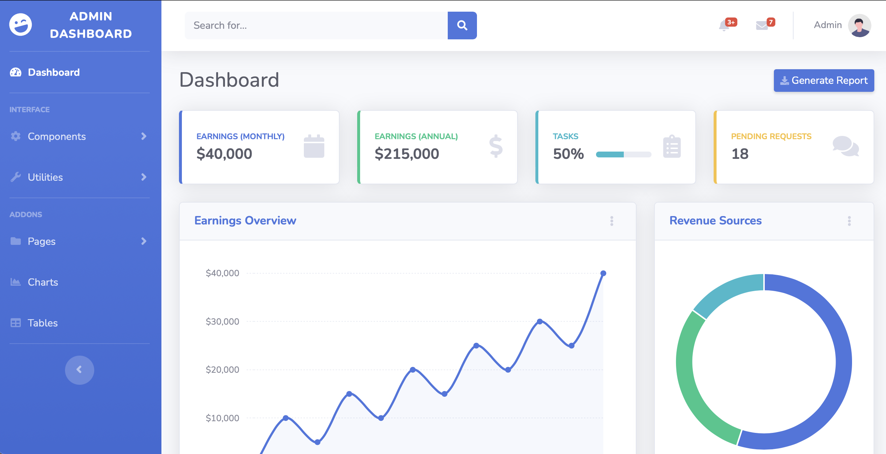
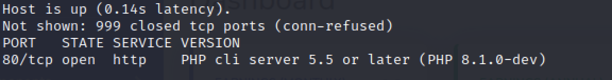
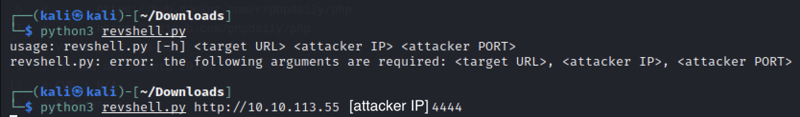
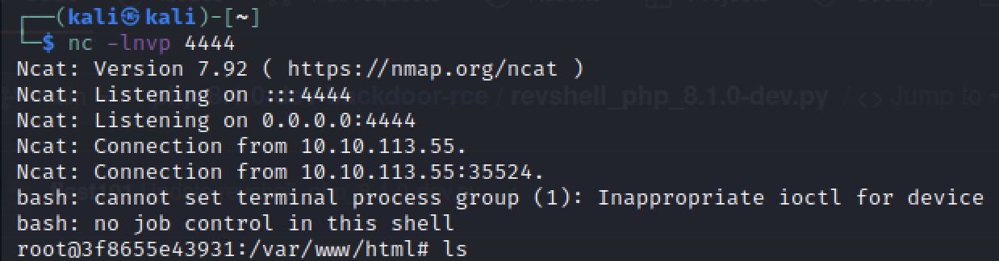
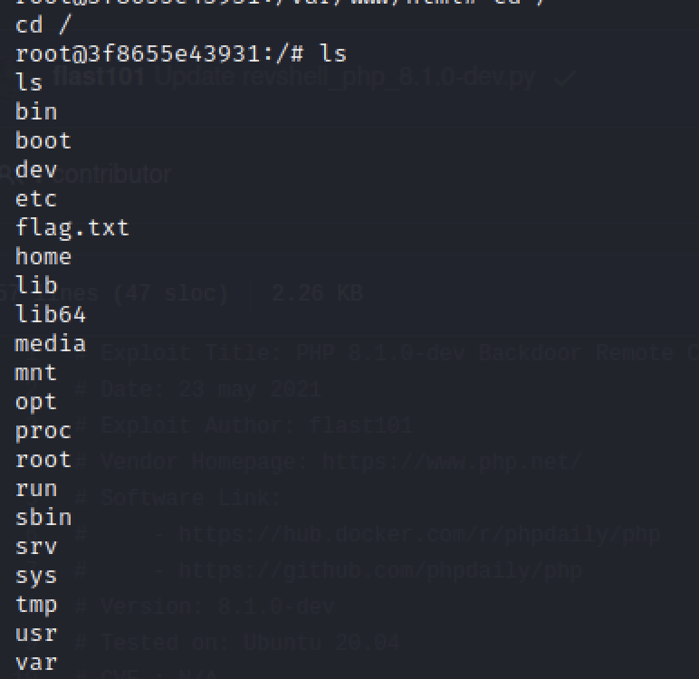
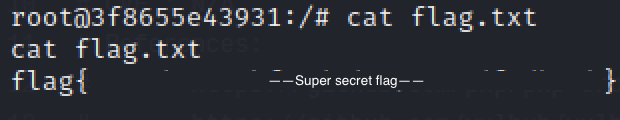

## TryHackMe - Agent T

Room description: 
_Agent T uncovered this website, which looks innocent enough, but something seems off about how the server responds..._

Difficulty level: Easy

After starting the room and going to the given IP, I'm brought to an Admin Dashboard

Clicking around the site doesn't seem to do much. I checked for a robots.txt file and also page source but didn't find anything interesting. The hint on TryHackMe said to pay attention the the headers when you frist load the page so I captured the request in BurpSuite, but didn't see anything interesting there either.

I ran a `nmap -sV 10.10.113.55` scan and that actually brought up something I could look at. Results showed me a PHP 8.1.0-dev so I did an internet search for exploits.

I discovered that this version is vulnerable to remote code execution and all you need to do is run a simple python script. This is the where I downloaded the reverse-shell exploit from: [flast101-github](https://github.com/flast101/php-8.1.0-dev-backdoor-rce)

Once downloaded, all I needed to do was set up a netcat listener `nc -lnvp 4444` and run the python script.

Going back to my netcat listener, and I have root access.

I moved to the root directory `cd /` and listed the contents `ls` and found the `flag.txt` file.

Then just `cat flag.txt` to reveal the flag!

I later looked at the official walkthrough to see what the hint was about. I was supposed to have seen the vulnerable PHP 8.1.0-dev version in the HTTP header, but I never was able to see it in BurpSuite  ` ¯\_(ツ)_/¯ ` I probably did something wrong on my end, but I was still able to get it done.
